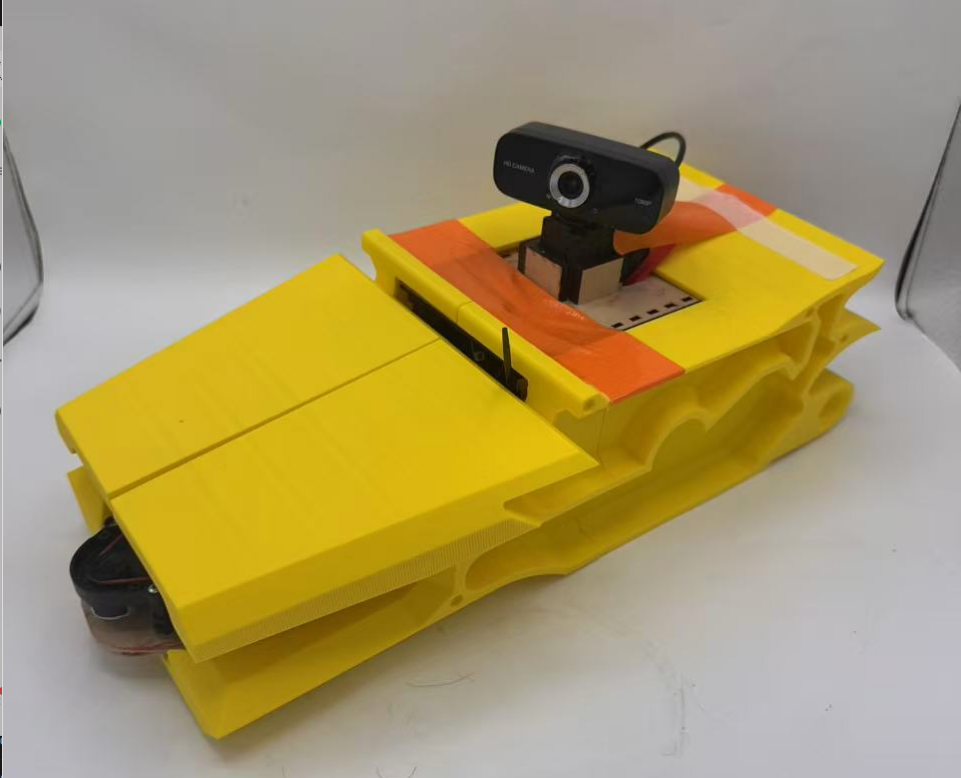
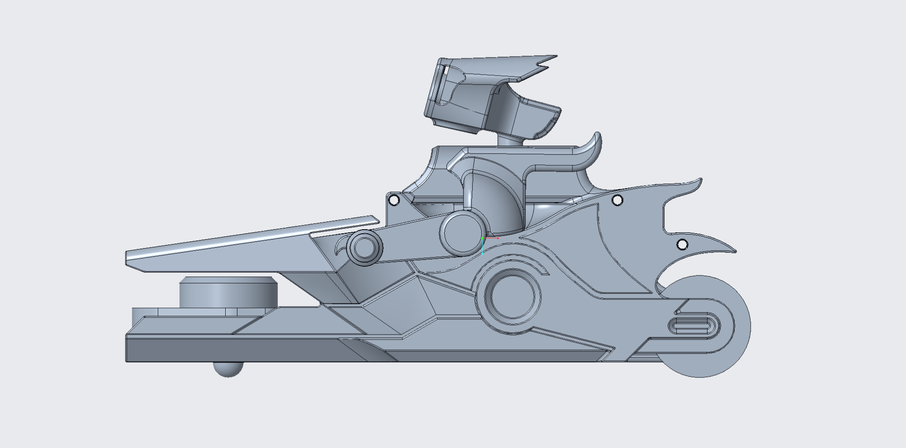
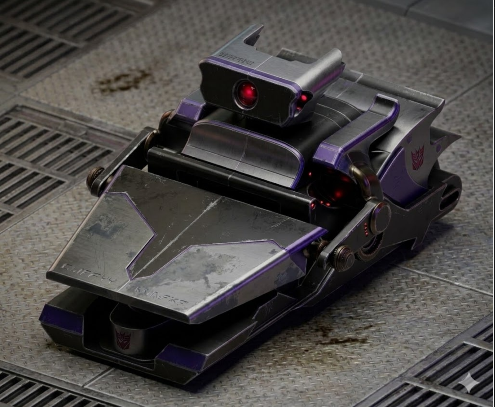

# Robot Videographer







## Project Overview

Robot Videographer is an autonomous camera robot built on a TurtleBot3 (Burger) platform. It uses a pan-tilt camera mount driven by a Dynamixel servo, a 2D LiDAR, and an onboard computer to:

1. **Detect and lock onto a person** using YOLO object detection (running on a PC via ROS 2).
2. **Pan the camera** to keep the person centered in frame using a PID-controlled Dynamixel motor.
3. **Follow the person** at a set distance using LiDAR-based PID velocity control.
4. **Build a map** of the environment in real-time with SLAM Toolbox, while filtering the tracked person out of the costmap to avoid treating them as a static obstacle.

## Video Demo

https://drive.google.com/file/d/12-Uf88K4ku7i8u4b3XxFzTL7EZ6tk2Iw/view?usp=drivesdk

## Team

- Alan Liu
- Xiangpeng Yu
- Tony Chen

---

## Setup Instructions

### Prerequisites

- Docker with NVIDIA GPU support (or a native ROS 2 Humble install)
- NVIDIA GPU (for YOLO inference on the PC)
- TurtleBot3 Burger with Dynamixel servo camera mount and USB camera

### Option A: Dev Container (Recommended)

1. Clone the repository:
   ```bash
   git clone https://github.com/tonyechen/Robot-Videographer.git
   cd Robot-Videographer
   ```

2. Open in VS Code and reopen in container when prompted. The container will:
   - Install all ROS 2 dependencies via `rosdep`
   - Build all packages with `colcon build`

### Option B: Native Install

1. Install [ROS 2 Humble](https://docs.ros.org/en/humble/Installation.html)

2. Install dependencies:
   ```bash
   sudo apt install ros-humble-slam-toolbox ros-humble-nav2-bringup \
     ros-humble-turtlebot3 ros-humble-usb-cam
   pip3 install ultralytics torch torchvision "numpy<2"
   rosdep install --from-paths src --ignore-src -r -y
   ```

3. Build:
   ```bash
   colcon build
   source install/setup.bash
   ```

4. Add to your `~/.bashrc`:
   ```bash
   export TURTLEBOT3_MODEL=burger
   export LDS_MODEL=LDS-02
   export ROS_DOMAIN_ID=<your_domain_id>
   ```

---

## Usage Instructions

### On the Robot (via SSH)

1. Launch hardware (motors + LiDAR):
   ```bash
   ros2 launch turtlebot3_gix_bringup hardware.launch.py
   ```

2. Launch camera:
   ```bash
   ros2 run usb_cam usb_cam_node_exe --ros-args \
     -p video_device:="/dev/video0" \
     -p image_width:=640 \
     -p image_height:=360 \
     -p framerate:=30.0 \
     -p pixel_format:="mjpeg2rgb"
   ```

### On the PC

Launch the full PC stack (YOLO + tracking + SLAM/Nav2 + navigator):
```bash
ros2 launch navigator pc_stack.launch.py
```

This starts in sequence:
1. `filtered_scan` — filters the person out of the LiDAR costmap + starts SLAM and Nav2
2. `navigator` — PID velocity controller to follow the person at a set distance
3. `yolo_ros` — YOLO person detection (subscribes to `/image_raw`)
4. `yolo2motor` — pans the camera servo to keep the person centered

### Teleop (manual control for testing)
```bash
ros2 run turtlebot3_teleop teleop_keyboard
```

### Motor testing
```bash
ros2 topic pub --once /gix_controller/joint_trajectory trajectory_msgs/msg/JointTrajectory \
  "{joint_names: ['gix'], points: [{positions: [1.0], time_from_start: {sec: 2}}]}"
```

---

## Package Overview

| Package | Description |
|---|---|
| `yolo2motor` | Locks onto a detected person and pans the camera servo via PID |
| `navigator` | LiDAR-based PID controller to follow the person at a set distance |
| `filtered_scan` | Filters the person's LiDAR returns to prevent them being mapped as an obstacle |
| `yolo_ros` | YOLO object detection node (third-party) |
| `turtlebot3` | TurtleBot3 hardware drivers (third-party) |
| `DynamixelSDK` | Dynamixel servo SDK (third-party) |

---

## License

See [LICENSE](LICENSE) for project license and all third-party dependency licenses.
